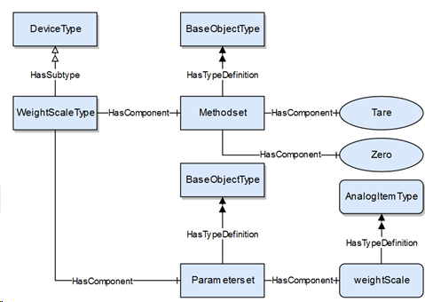
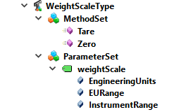

# DI-InformationModel
Tento projekt je venovaný:
- vytvorenie lokálnej kópie projektu 
- preskúmaniu informačného modelu  _informačného modelu_(IM) založeného na _Device Information Model(DI)_ .
- vytvoreniu vlastného IM.
Predpokladá sa prostredie Windows 7 a vyššie.

## Vytvorenie lokálnej kópie projektu 
Ako prvé je potrebné nainštalovať [git](https://www.develves.net/blogs/asd/articles/using-git-with-powershell-on-windows-10/) do počítača a stiahnuť si dáta z úložiska git. 
Vytvoríme nový adresár c:\informationmodel a vytvoríme klon projektu git [UA ModelCompiler](https://github.com/OPCFoundation/UA-ModelCompiler.git) a [DI-InformationModel
](https://github.com/STUBA-rupr/DI-InformationModel.git) cez prostredie _powershell_:
```
PS C:\> mkdir informationmodel
PS C:\> cd .\informationmodel\
PS C:\informationmodel> git clone https://github.com/OPCFoundation/UA-ModelCompiler.git --recursive
PS C:\informationmodel> git clone https://github.com/STUBA-rupr/DI-InformationModel.git
```
Projekt riešenie _UA-ModelCompiler_ je potrebné skompilovať, odporúčam MS Visual Studiu 2017 Community.

## Vytvorenie vlastného informačného modelu založeného na DI
Návrh objektového typu váhy (WeightScaleType) založeného na špecifikácii DI: 


Kód ktorý popisuje daný model by mohol vyzerať nasledovne: [modeldesignscale.xml](Published/master/WS/modeldesignscale.xml).

### Definícia menného priestoru
Súbor popisujúci informačný model obsahuje hlavičku v ktorej sú zadefinované menné priestory jazyka XML a OPC UA:
```
xmlns:uax="http://opcfoundation.org/UA/2008/02/Types.xsd"
xmlns:xsi="http://www.w3.org/2001/XMLSchema-instance"
xmlns:OpcUa="http://opcfoundation.org/UA/"
xmlns:DI="http://opcfoundation.org/UA/DI/"
xmlns:WS="http://phi-ware.com/FEISTU/WS/"
```
Kde
- **uax** je menný priestor základných dátových typov OPC UA
- **xsi** je menný priestor jadra XML
- **OpcUa** je menný priestor základnych objektov OPC UA
- **DI** je menný priestor objektov Device Information Model
- **WS** je menný priestor objektov Weight Scale Information Model

**_Poznámka: Názvy menných priestorov rozpoznávaju veľké a malé písmená._**

### Objektový typ WeightScaleType
Definícia objektového typu má nasledovnú syntax:
```
<ObjectType SymbolicName="WS:WeightScaleType" BaseType="DI:DeviceType" IsAbstract="false" SupportsEvents="true">
```
Kde `SymbolicName` je názov objektového typu, predpona **WS:** špecifikuje menný priestor a **WeightScaleType** je samotný názov typu. _Rodič (parent)_ objektového typu **WeightScaleType** sa definuje cez `BaseType`, kde rovnako predpona **DI:** definuje menný priestor a [**DeviceType**](https://opcfoundation.org/developer-tools/specifications-unified-architecture/part-100-device-information-model/) je objektový typ pre všeobecné zariadenie. `IsAbstract="false"` hovorí že typ nie je abstraktný a že teda je možné z neho vytvoriť inštanciu objektu.

Objektový typ **DeviceType** je odvodený od typu [**TopologyElementType**](Published/master/DI/OpcUaDiModel.xml), ktorý obsahuje nasledovnú definíciu podobjektov (_Children_):
```
<Children>
  <Object SymbolicName="DI:ParameterSet" TypeDefinition="OpcUa:BaseObjectType" ModellingRule="Optional">
    <Description>Flat list of Parameters</Description>
    <Children>
      <Variable SymbolicName="DI:ParameterIdentifier" TypeDefinition="OpcUa:BaseDataVariableType" ModellingRule="MandatoryPlaceholder">
        <BrowseName>&lt;ParameterIdentifier&gt;</BrowseName>
        <Description>A parameter which belongs to the topology element.</Description>
      </Variable>
    </Children>
  </Object>
  <Object SymbolicName="DI:MethodSet" TypeDefinition="OpcUa:BaseObjectType" ModellingRule="Optional">
    <Description>Flat list of Methods</Description>
    <Children>
      <Method SymbolicName="DI:MethodIdentifier" ModellingRule="MandatoryPlaceholder">
        <BrowseName>&lt;MethodIdentifier&gt;</BrowseName>
        <Description>A method which belongs to the topology element.</Description>
      </Method>
    </Children>
  </Object>
  ...
```
Tento kód definuje _kontajnéry_ kde sú vymenované premenné `Variable` a metódy `Method`. Aby bolo možné v objektovom type **WeightScaleType** definovať _metódy_ a _premenné_ je treba tento kód zreplikovať a modifikovať:
```
<ObjectType SymbolicName="WS:WeightScaleType" BaseType="DI:DeviceType" IsAbstract="false" SupportsEvents="true">
  <Description>Base weight scale type.</Description>
  <Children>
    <!-- Parameter set-->
    <Object SymbolicName="WS:ParameterSet" TypeDefinition="OpcUa:BaseObjectType" ModellingRule="Mandatory">
      <Description>Flat list of Parameters</Description>
      <Children>
        <Variable SymbolicName="WS:weightScale" TypeDefinition="OpcUa:AnalogItemType" DataType="OpcUa:Double" ModellingRule="Mandatory">
          <BrowseName>weightScale</BrowseName>
          <Description>Actual weight.</Description>
          <Children>
            <Property SymbolicName="OpcUa:InstrumentRange" ModellingRule="Optional" DataType="OpcUa:Range" />
            <Property SymbolicName="OpcUa:EURange" ModellingRule="Optional" DataType="OpcUa:Range" />
            <Property SymbolicName="OpcUa:EngineeringUnits" ModellingRule="Mandatory" DataType="OpcUa:EUInformation" />
          </Children>
        </Variable>
      </Children>
    </Object>
    <!-- Method set-->
    <Object SymbolicName="WS:MethodSet" TypeDefinition="OpcUa:BaseObjectType" ModellingRule="Mandatory">
      <Description>Flat list of Methods</Description>
      <Children>
        <Method SymbolicName="WS:Tare" ModellingRule="Mandatory">
          <BrowseName>Tare</BrowseName>
          <Description>Tare balnace.</Description>
        </Method>
        <Method SymbolicName="WS:Zero" ModellingRule="Mandatory">
          <BrowseName>Zero</BrowseName>
          <Description>Zero balnace.</Description>
        </Method>
      </Children>
    </Object>
  </Children>
</ObjectType>  
```
Ako je vidieť pribudla definícia _premennej_ `WS:weightScale` a _metód_ `WS:Tare` a `WS:Zero`. Dôležité je tiež poznamenať, že `ModellingRule` sa zmenilo na **Mandatory**, čo značí že uzly (objekty, premenné, motódy) sú **povinné** pre objekty odvodené od **WeightScaleType**. Inými slovami, všetky objekty odvodené od **WeightScaleType** budú obsahovať `WS:weightScale`, `WS:Tare` a `WS:Zero`.      

### Inštancia objektového typu WeightScaleType
Súbor [modeldesignscale.xml](Published/master/WS/modeldesignscale.xml) obsahuje v sekcii `<!-- Object instances -->` definíciu inštancie objektového typu WeightScaleType:
```
<Object SymbolicName="WS:WeightScale01" TypeDefinition="WS:WeightScaleType">
  <Description>Weight scale number 01</Description>
  <References>
    <Reference IsInverse="true">
      <ReferenceType>OpcUa:Organizes</ReferenceType>
      <TargetId>DI:DeviceSet</TargetId>
    </Reference>
  </References>
</Object>
```
Inštancia objektu sa vytvára cez kľúčové slovo `Object`. Podobne ako pri definícii objektového typu názov objektu obsahuje menný priestor. Uzol `<References>` obsahuje zoznam _referencií_. V tomto prípade ide o referenciu pomocou ktorej je možné objekt usporiadať do požadovanej hierarchie - zaradenie do adresáru **DeviceSet**.  

Súbor **modeldesignscale.xml** skompilujeme spustením dávkového súboru:
```
PS C:\informationmodel> cd .\DI-InformationModel\
PS C:\informationmodel\DI-InformationModel> .\PublishModel.bat
Building Model WS
..\UA-ModelCompiler\Bin\debug\Opc.Ua.ModelCompiler.exe   -d2 "Design\modeldesignscale.xml" -cg "Design\modeldesignscale.csv" -o2 "Published\master\WS\"
Trying file: C:\informationmodel\DI-InformationModel\Design\OpcUaDiModel.xml
Trying file: C:\informationmodel\DI-InformationModel\Design\OpcUaDiModel.csv
Copying Model files to Published\master\WS\modeldesignscale
        1 file(s) copied.
        1 file(s) copied.
```

## Preskúmanie informačného modelu _Device Information Model_
Program na vytváranie OPC UA _informačného modelu_ UA Modeler je možné stiahnuť na stránke: [Unified-Automation](https://www.unified-automation.com/products/development-tools/uamodeler.html).
Po spustení programu _UA Modeler_ je treba otvoriť projekt [weightscalenodeset.tt2pro](Published/master/WS/weightscalenodeset.tt2pro). Uzly obsahúce objektové typy DI informačného modelu sú v adresáry Types>ObjectTypes>TopologyElementType. Všetky uzly DI IM sú popísané v špecifikácii [Part 100: Device Information Model](https://opcfoundation.org/developer-tools/specifications-unified-architecture/part-100-device-information-model/). 

Projekt obsahuje aj informačný model pre zariadenie váha:

 

## Vytvorenie OPC UA serveru s IM weightScale
Ako prvé je potrebné vytvoriť kópiu OPC UA serveru podľa [návodu](http://opcfoundation.github.io/UA-.NETStandard/help/server_development.htm). **Ale** v našom prípade miesto _Reference Server_ použijeme _Boiler Server_. Upravený projekt je možné stiahnuť z git do nášho koreňového adresára:
```
PS C:\informationmodel> git clone https://github.com/STUBA-rupr/UA-.NETStandard.git
```
Popis zmien zdrojového kódu, spustenie servera ako aj preskúmanie objektov servera sa dá nájsť v [readme-SK.md](https://github.com/STUBA-rupr/UA-.NETStandard/blob/master/SampleApplications/Workshop/Boiler/WeightScaleServer/readme-SK.md#weightscaleserver) súbore.


